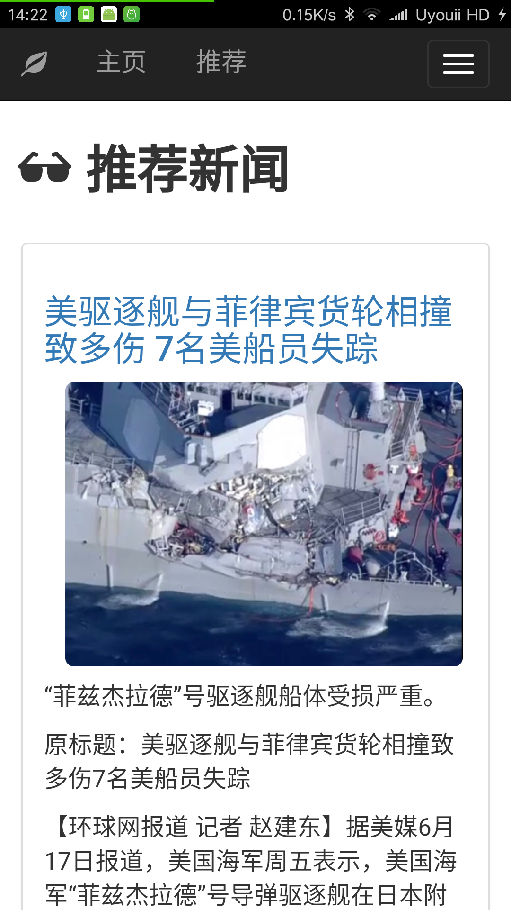
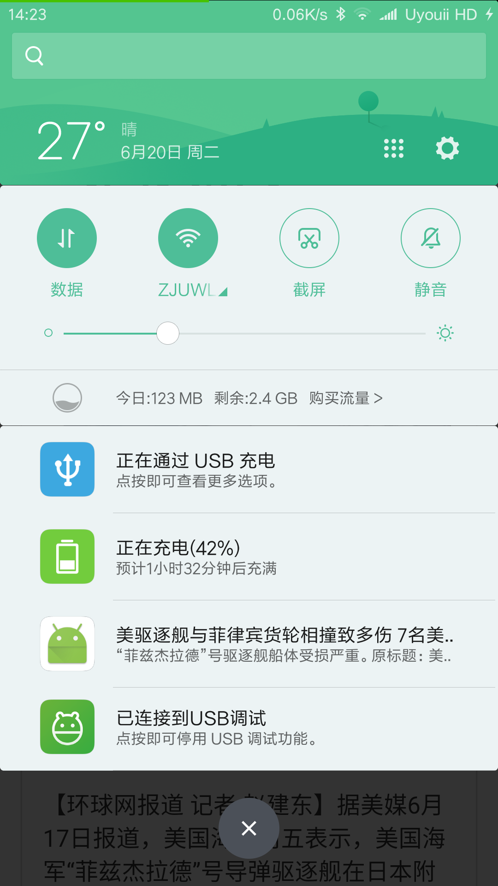

# 一、项目要求
1. 定时到各主流新闻门户网站抓取信息 
2. 用户访问网站时能看到聚合的信息内容 
3. 实现用户注册、登录功能，用户注册时需要填写必要的信息并验证，如用户名、密码要求在6字节以上，email 的格式验证，并保证用户名和 email 在系统中唯一。
4. 用户登录后可以设置感兴趣的新闻资讯栏目，用户访问网站的展示页面会根据用户设置做出相应的调整 
5. 实现一个 Android 或 iphone 客户端软件，功能同网站，但展示界面根据屏幕大小做 UI 的自适应调整，并能实现热点新闻推送 
6. 具体一定的学习能力，能根据用户的使用习惯调整展现的内容

# 二、项目架构及运行

## 1. 项目架构

* __前端框架__ : bootstrap
* __服务器框架__ : node.js koa2
* __数据库__ : mongodb 

## 2. 运行

首先安装node.js和mongodb

### 网页端

进入NewsAggregationWebsiteKoa2工程目录，在cmd运行`npm install`命令安装项目运行需要的模块。

在运行项目之前需要先运行新闻的爬取项目将新闻爬取到数据库中，新闻爬取的项目在 `PhoenixNews`目录下

每次运行服务器需要在NewsAggregationWebsiteKoa2目录下运行`npm start`命令打开服务器

随后在浏览器加载页面：localhost:3000/ 即可访问相应网站

### android端

android工程在NewsAggregrationApp下。
由于网页端设置为了响应式，并且支持移动端设备，所以APP直接调用了一个webview显该网页

在运行前需要修改MainActivity.java中的打开网页的ip地址的路径，设置为相应的ip地址即可

# 三、功能划分

## 1. 新闻爬取模块

新闻爬取模块由python实现。首先从各个新闻网站抓取新闻，并在抓取的过程中实现了对新闻的分类，例如：国际，军事，财经，文化，公益等。不同类别的新闻储存在数据库不同的类别中。

在爬取新闻内容时会爬取新闻的标题，新闻发布的时间，以及记录下新闻原网站的网址。新闻的内容会分为三类：p代表不同段落，strong代表加粗的字体和段落，img代表图片。如果是图片，则保存下该图片的链接。

## 2. 新闻列表加载模块

通过向服务器发送相应新闻的类别，从服务器获取到该新闻类别下所有新闻的列表。然后将该新闻类别下所有新闻的预览通过js动态加载到网页中。并在加载的过程中实现了分页的功能。

用户可以在新闻列表中选中或者取消喜欢的新闻，选中或者取消选中喜欢的新闻通过向服务器发送添加或删除喜欢新闻的请求实现。

## 3. 新闻内容加载模块

通过向服务器发送该新闻的id，从服务器获取该新闻的详细内容及信息，并加载到网页端。

用户在进入该网页时，会向服务器发送增加用户浏览记录的请求。服务器收到请求后会在用户相应的浏览记录中增加该新闻的记录。

用户同样可以在该页面选中或者取消选中喜欢的新闻。

## 4. 用户管理模块

用户可以通过注册模块向系统中注册，需要输入用户名，邮箱和密码，邮箱是唯一属性，用户注册时会检测该邮箱用户是否已经存在。邮箱需要是正确的邮箱的格式，密码需要保证两次密码输入完全相同。

用户登录输入邮箱和密码即可，向服务器发送请求后，服务器端会检测用户邮箱是否存在、邮箱和密码是否匹配等。

访问新闻页面时会检测此时用户是否登录，如果用户已经登录，则会记录用户的浏览新闻记录和同步用户关注或取消关注新闻的操作，统计出的数据用户用户新闻的个性推荐的分析。

## 5. 服务器路由模块

node.js下的routes根据前端请求的路径对请求进行分类，然后调用不同的模块对不同的请求进行处理，进而返回不同的数据。

## 6. 数据库交互模块 

通过不同的接口直接与数据库进行交互并返回结果。与mongodb的交互通过mongoose模块实现。

## 7. 新闻推荐模块

新闻推荐模块通过分析用户浏览新闻和关注新闻话题的个数得到用户比较喜爱的新闻的话题。在这些话题中的每个话题中提取一定数量的新闻（不包含用户浏览过的和关注过的新闻），得到新闻列表后返回给前端页面。

每次得到的新闻列表都会根据用户的浏览记录和关注新闻的记录动态生成。

## 8. Android客户端模块

由于前端在实现界面时实现了响应式的页面，故在android客户端只需调用一个webView将相应的网址加载出来即可以实现APP同样的功能。

新闻的推送通过APP定时向服务器发送获取推送的请求，服务器向Android客户端返回相应的推送的内容。客户端在获取推送内容后将推送内容推送至Andorid手机的状态栏，提醒用户观看相关新闻。

服务器推送的内容即为推荐新闻栏目的第一条新闻。


# 四、功能模块设计

## 1. 新闻主页

PC端新闻主页：


移动端新闻主页：
<div>
    
    
</div>


在访问新闻主页时首先会读取cookie中的新闻类别，如果读取不到，则默认访问新闻主页（即时新闻），如果读取到了新闻类别，则向服务器发送该新闻类别并获取该新闻类别下的新闻列表并显示出来。

在新闻列表中会显示出新闻的标题和部分正文以及图片，PC端设置新闻列表最大图片显示个数为3，在移动端则最多显示一张图片。如果新闻中没有出现图片则不显示图片。

如果想要访问新闻的详细信息，则点击新闻标题的链接或者详细按钮，页面变会跳转至单个新闻页面。

顶层的状态栏会根据PC端或者移动端进行调整，在PC端则会将各个新闻话题的栏目放在顶层状态栏，在移动端则会集成到右上角的按钮中。

在新闻主页中也实现了分页功能：


每页加载新闻的个也会更具PC端和移动端进行调整。

用户点击喜欢按钮可以关注该新闻，同时服务器中该用户的关注新闻列表会添加对应新闻的ID，在次点击则会取消关注，对应的该用户的关注新闻列表会减去该新闻的ID。
用户只有在的登录后可以使用该功能。

## 2. 新闻页面

PC端新闻页面：


移动端新闻页面：
<div>


</div>

新闻页面会显示出新闻的标题，发布时间，新闻的内容等信息。

在访问新闻页面时，客户端会向服务器发送该新闻的id，服务器通过新闻id得到新闻的详细信息并返回给客户端进行解析。

客户端会根据页面的大小（PC端还是移动端）来设置图片和标题的大小。

点击新闻右上角心型图标可以关注该新闻，再次点击会取消关注，同样会同步更改该用户数据库中的信息。

在页面的末尾会附带新闻原网站的链接，点击原文连接可以跳转至相应网站。

## 3. 用户注册

PC端注册：


移动端新闻注册：
<div>


</div>

首先点击下拉栏中的注册的选项进入用户注册的页面。

在用户注册时前端会检测用户名是否为空，邮箱格式是否正确，用户两次输入密码是否相同，如果都正确才向后端发送用户注册的请求。

后端在接受到注册请求后则检测用户注册的邮箱是否被占用，如果邮箱已经被占用，则返回false，提醒用户注册失败。否则提示该用户已成功注册。

## 4. 用户登录

PC端用户登录：


移动端用户登录：
<div>


</div>

用户在登录时需要输入邮箱和密码（邮箱是辨识用户的唯一ID）。

同样在登录时会检测邮箱格式。如果用户输入邮箱格式正确且密码不为空，则向服务器发送该用户的邮箱和用户输入的密码。服务器则调用与数据库模块连接的接口读取该用户的信息，如果找不到该邮箱或者用户输入的密码和数据库中的密码不匹配，则放回false，提示用户输入邮箱或者密码错误。否则用户登录成功，页面跳转至home。

## 5. 用户修改信息

PC端信息修改：


移动端信息修改：
<div>


</div>

用户可以修改除邮箱外的个人信息：用户名和密码等。用户在修改信息时同样要保证两次输入密码相同，用户名不能为空等。

如果用户信息修改成功，则提示用户信息已成功修改。

## 6. 用户个人主页

PC端个人主页：


移动端个人主页：
<div>


</div>

在登录后可以点击选择个人主页页面，在个人主页会显示出用户的用户名和邮箱以及用户浏览话题的记录和关注（喜欢）话题的记录。

关注和喜欢话题的情况以扇形统计图的形式呈现出来，图表可以直观的反映出用户对某类新闻话题的偏爱。将鼠标移动到相应统计图扇区的上方会显示出统计的信息。

## 7. 新闻个性推荐

PC端推荐页面：


移动端推荐页面：
<div>


</div>

推荐页面和普通的新闻页面基本一致，不同的是推荐页面获取新闻是获取的是服务器根据用户的浏览和喜欢新闻动态得到的新闻列表。

故推荐页面的新闻不是某一个类别的新闻，而是根据用户的喜欢和关注新闻分析出用户感兴趣的话题后，每个话题提取出前5个用户没有喜欢过和关注过的新闻，集合到新闻列表中返回给前端界面。

每次打开推荐页面都会根据用户此时的浏览和关注记录实时调整推荐的内容。

## 8. 移动端新闻推送

推送：
<div>


</div>

移动端界面实现了一个定时发送推送的功能。每隔一段时间移动端会向服务器发送获取推送内容的请求，服务器器会将推送的内容返回给移动端。移动端这将相应的内容显示在APP的通知栏上。

推送的内容为推荐新闻的第一个新闻的内容。

# 五、代码架构及实现

## 1. 工程代码架构
<div>


</div>

views目录下是前端的html页面，javastripts目录下是前端页面对应的js文件以及前端界面依赖的库文件。

routes目录下是服务器端处理前端请求的路由。其中database.js是服务器与数据库交互的接口。路由通过调用database.js提供的接口访问和修改数据库，并将得到的数据返回给前端。

## 2. 新闻爬取模块

新闻爬取模块分为几个模块实现：

1）相应主题对应新闻页面链接的爬取
```python
from urllib import request
from bs4 import BeautifulSoup
import re

class ThemeSpider(object):
    def __init__(self, theme_url,judge_url):
        self.theme_url = theme_url
        self.judge_url = judge_url

    def getLinkList(self):
        response = request.urlopen(self.theme_url)
        linkSet = set()
        linkList = []
        if response.getcode() != 200:
            print("fail to get to first page")
            return linkList
        html_cont = response.read()
        soup = BeautifulSoup(html_cont, 'html.parser', from_encoding='utf-8')

        h1 = soup.find('h1')
        if hasattr(h1,'a') and h1.a is not None and h1.a['href'] != "#":
            linkList.append({'title':h1.a.text.strip(),'href':h1.a['href'].strip()})
            linkSet.add(h1.a['href'])

        aLinks = soup.find_all('a', href=re.compile(self.judge_url))
        for link in aLinks:
            if link['href'] not in linkSet and link['href'] != "#":
                l = len(link.text.strip())
                if link.get('title',None) != None and link['title'] != '评论':
                    if len(link['title'].strip()) > 0:
                        linkList.append({'title':link['title'].strip(), 'href':link['href'].strip()})
                elif link.get('class',None) != None:
                    #排除掉网站上评论部分按钮的链接
                    if link['class'][0] != 'pinl' and l > 0:
                        linkList.append({'title':link.text.strip(),'href':link['href'].strip() })
                        # linkSet.add(link['href'])
                elif l > 0:
                    linkList.append({'title': link.text.strip(), 'href': link['href'].strip()})
                    # linkSet.add(link['href'])
                linkSet.add(link['href'])

        return linkList

```

2）新闻页面内容的爬取（主要是凤凰新闻网）
```python
from urllib import request
from bs4 import BeautifulSoup

class PageSpider(object):
    def __init__(self, page_url):
        self.page_url = page_url

    # @property
    def getContent(self):
        try:
            response = request.urlopen(self.page_url)
            if response.getcode() != 200:
                print("fail to get to first page")
                return None

            html_cont = response.read()
            soup = BeautifulSoup(html_cont, 'html.parser', from_encoding='utf-8')

            main_content = soup.find('div', id = 'main_content')
            titleDiv = soup.find('div', id="titL")
            head3 = soup.find('div',class_ = "yc_tit")

            if main_content is not None:
                #获取文章标题
                title = soup.find('h1').text.strip()
                #获取发行时间
                datetime = soup.find('span', itemprop = 'datePublished').text.strip()

                #获取正文
                contents = []
                soup_contents = main_content.find_all('p')
                for con in soup_contents:
                    img = con.find('img')
                    #图片
                    # a = con.get('style',None)
                    conclass = con.get('class',None)
                    if img != None:
                        text = con.text.strip()
                        if len(text) > 0:
                            contents.append(['p', text])
                        contents.append(['img', img['src']])
                    #正文
                    elif con.strong is not None:
                        text = con.text.strip()
                        if len(text) > 0:
                            contents.append(['strong', text])
                    else:
                        text = con.text.strip()
                        if len(text) > 0:
                            contents.append(['p', text])

                return {'title': title, 'datetime': datetime, 'content': contents}
            elif titleDiv is not None:
                #标题
                title = titleDiv.find('h1').text
                #日期及时间
                datetime = titleDiv.find('p').text

                head = soup.find('head')
                #获取解说文字
                p = head.find('meta',itemprop = 'description')['content']
                if len(p) > 0:
                    #获取图片
                    img = head.find('meta',itemprop = 'image')['content']

                    contents = [['img', img], ['p', p]]
 
                    return {'title': title, 'datetime': datetime, 'content': contents}
                else:
                    return None
            elif head3 is not None:
                #标题
                title = head3.find('h1').text
                #日期及时间
                datetime = head3.find('p').find('span').text
                #正文
                contents = []
                soup_contents = soup.find('div',id = "yc_con_txt").find_all('p')
                for con in soup_contents:
                    img = con.find('img')
                    if img is not None:
                        text = con.text.strip()
                        if len(text) > 0:
                            contents.append(['p', text])
                        contents.append(['img',img['src']])
                    elif con.strong is not None:
                        text = con.text.strip()
                        if len(text) > 0:
                            contents.append(['strong',text])
                    else:
                        text = con.text.strip()
                        if len(text) > 0:
                            contents.append(['p',text])
                return {'title':title, 'datetime':datetime, 'content':contents}
            else :
                return None
        except:
            print("Something wrog")
            return None

```

3)python连接mongodb数据库
```python
import pymongo

class ConnectDatabase(object):
    def __init__(self):
        connection = pymongo.MongoClient('127.0.0.1', 27017)
        self.db = connection.newsSpider
        self.news = self.db.news

    def insertToDatabase(self,type,href,newsData):
        print(newsData['title'])
        print(newsData['datetime'])
        if newsData['title'] is not None and newsData['datetime'] is not None and len(newsData['content']) > 0:
            isReturn = True
            for con in newsData['content']:
                if con[0] == 'p' or con[0] == 'strong':
                    isReturn = False
                    break
            if isReturn:
                return
            self.news.insert({'type':type,'href':href,'title':newsData['title'], 'datetime':newsData['datetime'],
                              'content':newsData['content']})

```
新闻爬取模块首先通过ThemeSpider模块爬去相应新闻主题下的各个新闻的链接，随后调用PageSpider，通过相应新闻链接获取该page下的新闻的内容。最后调用ConnectDatabase模块将爬去到的新闻内容储存在数据库中（数据库是mongodb）

爬虫项目推送到了github上，具体项目链接为：<https://github.com/TaiyouDong/NewsSpider>


## 3. 导航栏实现

导航栏通过boostrap的navbar框架实现，并实现了响应式结构。

```js
//设置显示哪些news_type
function set_which_show() {
    const window_width = window.innerWidth;
    const WIDTH = 767;
    if(window_width > WIDTH) {
        document.getElementById("news-dropdown").style.display='none';
        const li_list = document.getElementsByClassName("news-type");
        for( let i = 0; i < li_list.length; i++) {
            li_list[i].style.display = 'block';
        }
        maximgnumber = 3;
    }
    else {
        document.getElementById("news-dropdown").style.display='block';
        const li_list = document.getElementsByClassName("news-type");
        let i = 0;
        for( let i = 0; i < li_list.length; i++) {
            li_list[i].style.display = 'none';
        }
        maximgnumber = 1;
        atPC = false;
    }
}
```
首先在页面加载时根据页面大小判断此时页面是在PC端还是移动端。动态设置导航栏的选项是否显示。在PC端则将新闻话题的选项直接加载到导航栏，如果在移动端则隐藏导航栏上新闻话题的选项，将新闻话题的选项集合到一个下拉栏中，将下拉栏显示在导航栏。

通过设置组件的display属性可以设置组件是否显示。通过这种动态的设置变实现了导航栏中的栏目在不同大小的页面中的动态加载。

关于导航栏前端主要代码部分：
```html
<nav class="navbar navbar-inverse navbar-fixed-top" style="font-size: 20px">
    <div class="container-fluid">
        <!-- Brand and toggle get grouped for better mobile display -->
        <div class="navbar-header" id="page-header">
            <button type="button" class="navbar-toggle collapsed" data-toggle="collapse"
                    data-target="#bs-example-navbar-collapse-1" aria-expanded="false">
                <span class="sr-only">Toggle navigation</span>
                <span class="icon-bar"></span>
                <span class="icon-bar"></span>
                <span class="icon-bar"></span>
            </button>
            <a href="#" class="dropdown-toggle navbar-brand" data-toggle="dropdown" role="button" aria-haspopup="true" aria-expanded="false">
                <span class="glyphicon glyphicon-leaf"></span>
            </a>
            <ul class="dropdown-menu">
                <li><a href="https://github.com/TaiyouDong" target="_blank">关于作者</a></li>
            </ul>

            <a class="navbar-brand" href="#" onclick=jumpTo("即时")>&nbsp;主页</a>
            <a class="navbar-brand" href="#" onclick=jumpTo("推荐")>&nbsp;推荐</a>
        </div>

        <!-- Collect the nav links, forms, and other content for toggling -->
        <div class="collapse navbar-collapse" id="bs-example-navbar-collapse-1">

            <ul class="nav navbar-nav navbar-right">
                <!--<li><a href="#">Link</a></li>-->
                <li class="dropdown" id="notLoginButton">
                    <a href="#" class="dropdown-toggle" data-toggle="dropdown" role="button" aria-haspopup="true" aria-expanded="false">
                        <span class="glyphicon glyphicon-user"></span>
                        <!--&nbsp;登录-->
                        <span class="caret"></span>
                    </a>
                    <ul class="dropdown-menu">
                        <li><a href="/login">登录</a></li>
                        <li><a href="/register">注册</a></li>
                        <!--<li><a href="#">个人主页</a></li>-->
                        <!--<li><a href="#">修改密码</a></li>-->
                        <!--<li role="separator" class="divider"></li>-->
                        <!--<li><a href="#">退出当前账号</a></li>-->
                    </ul>
                </li>

                <li class="dropdown" id="alreadyLoginButton">
                    <a href="#" class="dropdown-toggle" data-toggle="dropdown" role="button" aria-haspopup="true" aria-expanded="false">
                        <span class="glyphicon glyphicon-user" id="showName"></span>
                        <span class="caret"></span>
                    </a>
                    <ul class="dropdown-menu">
                        <li><a href="/userpage">个人主页</a></li>
                        <li><a href="/changeMessagePage">修改个人信息</a></li>
                        <li role="separator" class="divider"></li>
                        <li><a href="#" onclick=showLogoutModal()>退出当前账号</a></li>
                    </ul>
                </li>
            </ul>

            ······
        </div><!-- /.navbar-collapse -->
    </div><!-- /.container-fluid -->
</nav>
```

## 4.新闻列表的加载

### 前端加载
```js
function getNewsList() {
    if(newsType !== "推荐") {
        $.post("/news",
            {
                type : newsType
            },
            function (data) {
                newsData = data;
                showNewsList();
                createButton(Math.ceil(newsData.length / NUM));
            }
        );
    }
    else {
        $.post("/news/recommend",
            {
                email : email
            },
            function (data) {
                newsData = data;
                showNewsList();
                createButton(Math.ceil(newsData.length / NUM));
            }
        );
    }
}

//显示出当页新闻列表
function showNewsList() {
    let maxLength = 100;
    let maxLine = 4;
    if(atPC) {
        maxLength = 180;
        maxLine = 6;
        NUM = 10;
    }

    let likesNewsSet = new Set();
    if(newsType === "推荐") {
        let list = [];
        for (let key in user.likes) {
            if (key!== "推荐")
                list = list.concat(user.likes[key]);
        }
        likesNewsSet = new Set(list);
    }
    else {
        if(user!== undefined && user.likes !== undefined && user.likes[newsType] !== undefined) {
            likesNewsSet = new Set(user.likes[newsType]);
        }
    }


    for(let i = NUM * (pageNum - 1); i < newsData.length && i < NUM * pageNum; i++) {
        let imgdiv = document.createElement("div");

        let j = 0,imgnumber = 0;
        const content = newsData[i]['content'];

        let num = getimgNumber(content);
        if(num > 1 && atPC) {
            imgdiv.setAttribute("class","container-fluid");
        }

        while(j < content.length - 1 && imgnumber < maximgnumber) {
            if (content[j][0] !== "img") {
                j++;
                continue;
            }
            let div = document.createElement("div");

            div.setAttribute("class", "col-sm-4 text-center");
            let img = document.createElement("img");
            img.setAttribute("src", content[j][1]);

            img.setAttribute("class", "img-tab img-rounded");

            div.appendChild(img);
            imgdiv.appendChild(div);
            j++;
            imgnumber++;
        }

        let div1 = document.createElement("div");
        div1.setAttribute("class","panel panel-default");
        let div2 = document.createElement("div");
        div2.setAttribute("class","panel-body");
        let h1;
        if(atPC)
            h1 = document.createElement("h2");
        else h1 = document.createElement("h3");
        let a = document.createElement('a');
        a.innerText = newsData[i]['title'];
        a.setAttribute("href","/newspage");
        //a.setAttribute("target","_blank");
        a.news_id = newsData[i]['_id'];
        a.onclick = function () {
            document.cookie = "news_id= " + this.news_id + "; path=newspage.html";
        };
        h1.appendChild(a);
        let length = 0;
        div2.appendChild(h1);
        div2.appendChild(imgdiv);
        let p = document.createElement("p");
        div2.appendChild(p);
        j = 0;
        while(j < content.length && j < maxLine && length < maxLength) {
            let text;
            if(content[j][0] === 'p') {
                text = document.createElement('p');
            }
            else if(content[j][0] === 'strong') {
                text = document.createElement('strong');
            }
            else if(content[j][0] === 'img') {
                j++;
                continue;
            }

            if(length + content[j][1].length > maxLength) {
                text.innerText = content[j][1].substr(0,maxLength - length) + "·····";
                length = maxLength;
            }
            else {
                text.innerText = content[j][1];
                length += content[j][1].length;
                if(j >= maxLine) {
                    text.innerText = text.innerText + '·····';
                }

            }
            div2.appendChild(text);
            j++;
        }

        let spandiv = document.createElement("div");
        spandiv.setAttribute("class","pull-left");
        let like = false;
        if(likesNewsSet.has(newsData[i]['_id'])) {
            like = true;
        }
        spandiv.setAttribute("style","font-size:20px;color:#00868B;");

        let spanWord = document.createElement('span');
        let span2 = document.createElement("span");
        span2.setAttribute("class","glyphicon glyphicon-heart");
        span2.setAttribute("aria-hidden","true");
        if(like) {
            span2.setAttribute("style","font-size:25px; color:#EE2C2C");
            spanWord.innerText = "已喜欢";
            spanWord.setAttribute("style","color:#EE2C2C")
        }
        else {
            span2.setAttribute("style","font-size:25px; color:#00868B");
            spanWord.innerText = "喜欢";
            spanWord.setAttribute("style","color:#00868B")
        }
        span2.news_id = newsData[i]['_id'];
        span2.like = like;
        span2.wordDiv = spanWord;
        span2.newsType = newsData[i]['type'];

        let a3 = document.createElement("a");
        a3.appendChild(span2);
        span2.onclick = function () {
            let news_id = this.news_id;
            let span = this;
            let spanWord = this.wordDiv;
            let newsType = this.newsType;
            if(email !== "") {
                if(!span.like) {
                    $.post("/users/addLikes", {
                            email: email,
                            news_id : news_id,
                            newsType: newsType
                        },
                        function (data) {
                            span.setAttribute("style","font-size:25px; color:#EE2C2C");
                            spanWord.innerText = "已喜欢";
                            spanWord.setAttribute("style","color:#EE2C2C")
                            span.like= !span.like;
                        }
                    );
                }
                else{
                    $.post("/users/deleteLikes", {
                            email: email,
                            news_id : news_id,
                            newsType: newsType
                        },
                        function (data) {
                            span.setAttribute("style","font-size:25px; color:#00868B");
                            spanWord.innerText = "喜欢";
                            spanWord.setAttribute("style","color:#00868B")
                            span.like= !span.like;
                        }
                    );
                }
            }
        };

        spandiv.appendChild(spanWord);
        spandiv.appendChild(span2);

        let a2 = document.createElement("a");
        a2.setAttribute("href","/newspage");
        //a2.setAttribute("target","_blank");
        a2.setAttribute("class","pull-right");
        let btn = document.createElement('button');
        btn.setAttribute("class","btn btn-default");
        btn.innerText = "详细";
        btn.news_id = newsData[i]['_id'];
        btn.onclick = function () {
            document.cookie = "news_id= " + this.news_id + "; path=newspage.html";
        };
        a2.appendChild(btn);
        div2.appendChild(a2);
        div2.appendChild(spandiv);
        div1.appendChild(div2);
        // let container = document.getElementById("news-container");

        document.getElementById("news-container").appendChild(div1);
    }
}
```

### 后端响应
```js
const router = require('koa-router')();
const db = require('./database');

router.prefix('/news');

router.post('/', async (ctx, next) => {
    const type = ctx.request.body.type || '';
    console.log(type);
    if( type !== '') {
        ctx.body = await db.getTypeNews(type);
    }
    else ctx.body = "";
});

router.post('/recommend', async (ctx, next) => {
    const email = ctx.request.body.email || '';

    if(email === '')
        ctx.body = await db.getTypeNews('即时');
    else {
        ctx.body = await db.getRecommendNews(email);
    }


});

module.exports = router;
```
### 服务器操作
```js
const getTypeNews = async(type) => {
    return newsModel.find({'type':type},async(err,docs) => {
        if(err) {
            console.log(err);
        }
    });
};
```

在绘制新闻列表时需要首先想服务器发送post请求，发送想要获取的新闻类别，从而从数据库获取相应的新闻列表。

在向服务器发送请求时这里需要判断一下，请求的新闻类别是否为推荐新闻，如果是推荐新闻，则需要从服务器获取推荐新闻的列表，如果是普通的类别，则直接获取新闻列表即可。

在显示新闻的列表时需要根据当前新闻的页码来确定显示相应的新闻列表。

在显示相应新闻的简略信息时，需要根据屏幕大小来判此时是在PC端还是移动端。如果是在PC端，则新闻简略信息显示图片的上限为3，如果在移动端则设置为1。

如果此时用户已经登录，则在加载相应新闻时需要判断用户是否之前关注过该新闻，如果关注过则将心型标记设置为红色（已喜欢)。同时为其设置回调函数，如果用户关注或者取消关注该新闻，则向数据库发送相应的关注或者取消关注的请求。

同时给新闻的标题和详情按钮附加访问新闻页面的链接，用户点击新闻标题或者详情按钮便可以跳转到相应新闻内容显示的页面。

服务器通过前端访问的路径响应不同的请求，如果路径为"/news"，则返回新闻类别列表下的内容，如果路径为"/news/recommend"，则返回推荐的新闻。

## 5. 新闻内容页面的显示

### 前端加载
```js
function getNewsContent() {
    $.post("/getnewscontent",
        {
            news_id : news_id
        },
        function (data) {
            let likesNewsSet = new Set();
            if(user!== undefined && user.likes !== undefined && user.likes[newsType] !== undefined)
                likesNewsSet = new Set(user.likes[newsType]);

            const message = data[0];
            let show_area = document.getElementById("news-show");

            if(atPC) {
                document.getElementById("new-title2").style.display='none';
                document.getElementById("new-title1").style.display='block';
            }
            else {
                document.getElementById("new-title2").style.display='block';
                document.getElementById("new-title1").style.display='none';
            }

            document.getElementById("new-title1").innerText = data[0]['title'];
            document.getElementById("new-title2").innerText = data[0]['title'];
            document.getElementById("news-time").innerText = data[0]['datetime'];
            const contents = data[0]['content'];

            for (let i = 0; i < contents.length; i++) {
                if(contents[i][0] === 'p') {
                    let p = document.createElement('p');
                    p.style.whiteSpace = "pre-wrap";
                    p.innerText  = "       " + contents[i][1];

                    if(i > 0 && contents[i-1][0] === "img") {
                        p.setAttribute("class","text-center");
                    }

                    show_area.appendChild(p);
                }
                else if(contents[i][0] === 'strong') {
                    let p = document.createElement('p');
                    let strong = document.createElement('strong');
                    strong.style.whiteSpace = "pre-wrap";
                    strong.innerText =contents[i][1];

                    if(i > 0 && contents[i-1][0] === "img") {
                        strong.setAttribute("class","text-center");
                    }
                    p.appendChild(strong);
                    show_area.appendChild(p);
                }
                else if(contents[i][0] === "img") {
                    let div = document.createElement("div");
                    div.setAttribute("class","text-center");
                    let img = document.createElement("img");
                    img.setAttribute("src",contents[i][1]);
                    if(atPC) {
                        img.setAttribute("class","img-rounded img-PC");
                    }
                    else {
                        img.setAttribute("class","img-rounded img-mobile");
                    }
                    div.appendChild(img);
                    let br = document.createElement("br");
                    show_area.appendChild(div);
                    show_area.appendChild(br);
                }
            }
            let a = document.createElement('a');
            //a.setAttribute('class','pull-left');
            a.setAttribute('href',data[0]['href']);
            a.setAttribute('target','_blank');
            a.innerText = "原文链接";
            show_area.appendChild(a);

            let spanHeart = document.getElementById("likeHeart");
            let spanWord = document.getElementById("likeWord");

            let like = false;
            if(likesNewsSet.has(news_id)) {
                like = true;
            }
            if(like){
                spanHeart.setAttribute("style","font-size:25px; color:#EE2C2C");
                spanWord.innerText = "已喜欢";
                spanWord.setAttribute("style","font-size:22px; color:#EE2C2C")
            }
            else{
                spanHeart.setAttribute("style","font-size:25px; color:#00868B");
                spanWord.innerText = "喜欢";
                spanWord.setAttribute("style","font-size:22px; color:#00868B")
            }
            spanHeart.news_id = news_id;
            spanHeart.like = like;

            spanHeart.onclick = function () {
                let news_id = this.news_id;
                let span = this;
                if(email !== "") {
                    if(!span.like) {
                        $.post("/users/addLikes", {
                                email: email,
                                news_id : news_id,
                                newsType: newsType
                            },
                            function (data) {
                                span.setAttribute("style","font-size:25px; color:#EE2C2C");
                                document.getElementById("likeWord").innerText = "已喜欢";
                                document.getElementById("likeWord").setAttribute("style","font-size:22px; color:#EE2C2C");
                                span.like = !span.like;
                            }
                        );
                    }
                    else{
                        $.post("/users/deleteLikes", {
                                email: email,
                                news_id : news_id,
                                newsType: newsType
                            },
                            function (data) {
                                span.setAttribute("style","font-size:25px; color:#00868B");
                                document.getElementById("likeWord").innerText = "喜欢";
                                document.getElementById("likeWord").setAttribute("style","font-size:22px; color:#00868B");
                                span.like = !span.like;
                            }
                        );
                    }
                }
            };
        }
    );
}
```

### 后端响应
```js
const router = require('koa-router')();
const db = require('./database');

router.prefix('/getnewscontent');

router.post('/', async (ctx, next) => {
    const id = ctx.request.body.news_id || '';
    console.log(id);
    if( id != '') {
        ctx.body = await db.getNewsContent(id);
        //ctx.body = "haha";
    }
    else {
        ctx.body = "";
        console.log("id is null");
    }
});
module.exports = router;
```

### 服务器操作
```js
let ObjectID = require('mongodb').ObjectID;

const getNewsContent = async(id) => {
    return newsModel.find({_id:ObjectID(id)} , async(err,docs) => {
        if(err) {
            console.log(err);
        }
    })
};
```

新闻内容的获取同样需要向服务器发送post请求，获取新闻的详细的内容：标题，发布时间，正文，原文链接等。

在加载新闻正文时需要根据新闻内容的不同，进行不同的描述。新闻整正文内容有p、strong和img三种。p即是普通正文，strong为加粗字体。img需要创建img对象，并将其src属性设置为爬爬取的内容（爬取的内容即为img的链接）。

服务器接到用户获取新闻内容的请求后，向调用数据库模块提供的接口getNewsContent获取相应的新闻的内容并返回给前端。

## 6. 用户注册

### 前端界面
```js
function checkInput() {
    resetInputGroupColor();
    //先去掉字符串两端的空格
    let username = $.trim(document.getElementById("username").value);
    let email = $.trim(document.getElementById("email").value);
    let password1 = $.trim(document.getElementById("password1").value);
    let password2 = $.trim(document.getElementById("password2").value);
    //验证邮箱格式的正则表达式
    let emailReg = /^\w+((-\w+)|(\.\w+))*\@[A-Za-z0-9]+((\.|-)[A-Za-z0-9]+)*\.[A-Za-z0-9]+$/;
    let isOk = true;

    if(username == "") {
        document.getElementById("input-name-group").setAttribute("class","form-group has-error");
        document.getElementById("username-tip").innerText = "用户名不能为空";
        isOk = false;
    }
    else document.getElementById("input-name-group").setAttribute("class","form-group has-success");

    if(email == "") {
        document.getElementById("input-email-group").setAttribute("class","form-group has-error");
        document.getElementById("email-tip").innerText = "邮箱不能为空";
        isOk = false;
    }
    else if(!emailReg.test(email)) {
        document.getElementById("input-email-group").setAttribute("class","form-group has-error");
        document.getElementById("email-tip").innerText = "邮箱格式错误";
        isOk = false;
    }
    else document.getElementById("input-email-group").setAttribute("class","form-group has-success");

    if(password1 == "") {
        document.getElementById("input-password1-group").setAttribute("class","form-group has-error");
        document.getElementById("password1-tip").innerText = "密码不能为空";
        isOk = false;
    }
    else if(password2 == "") {
        document.getElementById("input-password2-group").setAttribute("class","form-group has-error");
        document.getElementById("password2-tip").innerText = "密码不能为空";
        isOk = false;
    }
    else if(password1 != password2) {
        document.getElementById("input-password1-group").setAttribute("class","form-group has-error");
        document.getElementById("input-password2-group").setAttribute("class","form-group has-error");
        document.getElementById("password1-tip").innerText = "两次密码不相同";
        isOk = false;
    }
    else {
        document.getElementById("input-password1-group").setAttribute("class","form-group has-success");
        document.getElementById("input-password2-group").setAttribute("class","form-group has-success");
    }

    if(isOk == true) {
        $.post("/users/addUser",
            {
                username:username,
                email : email,
                password : password1
            },
            function (data) {
                if(data) {
                    $('#myModal').modal('show');
                }
                else {
                    $('#myModal2').modal('show');
                }
               // $('#myModal').modal('show');
                resetInputGroupColor();
                clearInput();
            }
        );
    }
}
```

### 后端响应
```js
router.post('/addUser', async (ctx, next) => {
    const name = ctx.request.body.username || '';
    const email = ctx.request.body.email || '';
    const password = ctx.request.body.password || '';
    if (await db.getEmailNumber(email) === 1) {
        ctx.body = false;
    }
    else {
        await db.insertUser(name,email,password);
        ctx.body = true;
    }
});
```

### 数据库接口
```js
const getEmailNumber = async(email) => {
  return usersModel.find({'email':email}, async(err,docs) => {
      if(err) {
          console.log(err);
      }
  }).count()
};

const insertUser = async(name,email,password) => {
    let user = new usersModel({
        name:name,
        email:email,
        password:password
    });
    user.save( async (err,doc) => {
        if(err) {
            console.log('save error:' + err);
        }
        else {
            console.log('save success\n' + doc);
        }
    })
};

```

用户注册操作需要在前端检测用户的输入，及检测用户名、邮箱、密码及确认密码是否为空，邮箱格式是否正确，两次输入密码是否相同等。

如果用户输入格式正确，则向后端发送添加用户的请求。后端接受到请求后首先查找邮箱是否重复，如果重复则返回false，即注册失败，否则返回true，提醒用户注册成功。


## 7. 用户登录

### 前端界面
```js
function checkInput() {
    resetInputGroupColor();
    let email = $.trim(document.getElementById("email").value);
    let password = $.trim(document.getElementById("password").value);
    //验证邮箱格式的正则表达式
    let emailReg = /^\w+((-\w+)|(\.\w+))*\@[A-Za-z0-9]+((\.|-)[A-Za-z0-9]+)*\.[A-Za-z0-9]+$/;
    let isOk = true;

    if(email == "") {
        document.getElementById("input-email-group").setAttribute("class","form-group has-error");
        document.getElementById("email-tip").innerText = "邮箱不能为空";
        isOk = false;
    }
    else if(!emailReg.test(email)) {
        document.getElementById("input-email-group").setAttribute("class","form-group has-error");
        document.getElementById("email-tip").innerText = "邮箱格式错误";
        isOk = false;
    }
    else document.getElementById("input-email-group").setAttribute("class","form-group has-success");

    if(password == "") {
        document.getElementById("input-password-group").setAttribute("class","form-group has-error");
        document.getElementById("password-tip").innerText = "密码不能为空";
        isOk = false;
    }
    else {
        document.getElementById("input-password-group").setAttribute("class","form-group has-success");
    }

    if(isOk == true) {
        $.post("/users/checkUser",
            {
                email : email,
                password : password
            },
            function (data) {
                if(data) {
                    $('#myModal').modal('show');
                    document.cookie = "email= " + email + "; path=/";
                    $.post("/users/getUserName",
                        {
                            email : email
                        },
                        function (data) {
                            user = data;
                            document.cookie = "user= " + user + "; path=/";
                            document.getElementById("showName").innerText = user;
                            jumpToHome();
                        }
                    );
                }
                else {
                    $('#myModal2').modal('show');
                }
                resetInputGroupColor();
                clearInput();
            }
        );
    }
}
```
### 服务器操作
```js
router.post('/checkUser',async(ctx,next)=>{
    const email = ctx.request.body.email || '';
    const password = ctx.request.body.password || '';
    console.log('email: ' + email + " password: " + password);
    ctx.body = await db.getUserNumber(email, password) > 0;
});
```

### 数据库接口
```js
const getUserNumber = async (email, password)=> {
    //返回email和password匹配的用户的个数
    return usersModel.find({'email':email,'password':password}, async(err,docs) => {
        if(err) {
            console.log(err);
        }
    }).count()
};
```

用户登录操作与用户注册类似，同样需要检测用户的输入是否合法：密码和邮箱是否为空，邮箱格式是否正确等。

格式正确后会将用户输入的信息发送给服务器 ，服务器调用数据库接口查询符合用户输入信息的用户是否存在，如果存在，则表明用户登录成功，否则用户登录失败。


## 8. 新闻推荐模块

新闻推荐相关的操作主要在服务器端进行处理。

### 服务器端处理
```js
router.post('/recommend', async (ctx, next) => {
    const email = ctx.request.body.email || '';

    if(email === '')
        ctx.body = await db.getTypeNews('即时');
    else {
        ctx.body = await db.getRecommendNews(email);
    }
    
});
```

### 数据库接口
```js

const getUser = async(email)=> {
    return usersModel.find({'email':email},async(err,docs) => {
        if(err) {
            console.log(err);
        }
    });
};

const getRecommendNews = async(email)=> {
    const MAX = 5;
    let user = await getUser(email);
    user = user[0];
    let scanList = [];
    let likeList = [];
    for( let key in user.scans) {
        if(key === " " || key === "undefined" || key === "即时") {
            continue;
        }
        if(scanList.length < 5){
            scanList.push(key);
        }
        else {
            let min = 0;
            for(let i = 1; i < scanList.length;i++) {
                if(user.scans[scanList[i]] < user.scans[scanList[min]])
                    min = i;
            }
            if(user.scans[key] > user.scans[scanList[min]]) {
                scanList[min] = key;
            }
        }
    }

    for( let key in user.likes) {
        if(key === " " || key === "undefined" || key === "即时") {
            continue;
        }
        if(likeList.length < 5){
            likeList.push(key);
        }
        else {
            let min = 0;
            for(let i = 1; i < likeList.length;i++) {
                if(user.likes[likeList[i]].length < user.likes[likeList[min]].length)
                    min = i;
            }
            if(user.likes[key].length > user.scans[likeList[min]].length) {
                likeList[min] = key;
            }
        }
    }

    let list = scanList.concat(likeList);
    let typeSet = new Set(list);
    console.log(typeSet);

    let resultList = [];

    for (let key of typeSet) {
        let newsList = await getTypeNews(key);
        let hasLike = new Set(user.likes[key]);
        let i = 0;
        for (let news of newsList) {
            if(! hasLike.has(news['_id'].toString())) {
                resultList.push(news);
                i++;
            }
            else continue;

            if(i >= 5)
                break;
        }
    }

    return resultList;
};
```

新闻推荐功能通过客户端向服务器发送用户的email获取相应的推荐列表。

在服务器端获取推荐新闻列表时，首先根据email读取用户的信息，主要是user.scans（浏览新闻记录）的信息和user.likes（关注新闻记录）的信息。

首先通过对user.scans和user.likes进行分析，得到用户浏览和关注较多的话题的列表。随后合并这些列表，去除掉里面重复的元素，得到需要用户关注度较高的话题列表。

随后访问这些话题对应的数据库的新闻，每个话题中的新闻获取5个，在获取新闻时会检测新闻和id，匹配用户的likes和scans列表，如果该新闻已经被用户浏览或者关注过，则不会给予推荐。最后将推荐的新闻列表放在resultlist中返回给前端。


### 更新user.scans
user.scans数据会在用户访问新闻时自动更新：

前端请求
```js
function addScans() {
    if(email !== "") {
        $.post("/users/addScans", {
            email: email,
            news_id : news_id,
            newsType : newsType
        },
        function (data) {

        }
        );
    }
}
```

服务器响应
```js
router.post('/addScans',async(ctx,next)=> {
    const email = ctx.request.body.email || '';
    const news_id = ctx.request.body.news_id || ' ';
    const newsType = ctx.request.body.newsType || ' ';
    await db.addScans(email,news_id,newsType);

    ctx.body = true;
});
```
数据库接口
```js
const addScans = async(email,news_id,newstype)=> {

    let user;
    await usersModel.find({'email':email},async(err,docs)=> {
        if(err)
            console.log(err);
        user = docs[0];

        console.log(newstype);
        // console.log(user);
        //更新User的浏览记录
        if(user.scans !== undefined) {
            let scans = user.scans;
            if(scans[newstype] !== undefined) {
                scans[newstype]++;
                console.log("1" + scans);
                await usersModel.update({'email':email},{'$set':{'scans':scans}},async(err,docs)=> {
                    if(err){
                        console.log(err)
                    }
                });
            }
            else {
                scans[newstype] = 1;
                console.log("2" + scans);
                await usersModel.update({'email':email},{'$set':{'scans':scans}},async(err,docs)=> {
                    if(err) {
                        console.log(err)
                    }
                })
            }
        }
        else {
            let scans = new Map();
            scans[newstype] = 1;
            console.log("3" + scans);
            await usersModel.update({'email':email},{'$set':{'scans':scans}})
        }
    });

};
```
在更新浏览记录时，首先会检测用户之前是否有当前新闻话题的浏览记录，如果存在，则将浏览的次数递增1，如果不存在，则在map新建该项，并将其值初始化为1。

### 添加user.likes
在用户点击新闻中关注新闻按钮后则会调用添加user.likes的请求

前端请求
```js
if(!span.like) {
    $.post("/users/addLikes", {
            email: email,
            news_id : news_id,
            newsType: newsType
        },
        function (data) {
            span.setAttribute("style","font-size:25px; color:#EE2C2C");
            document.getElementById("likeWord").innerText = "已喜欢";
            document.getElementById("likeWord").setAttribute("style","font-size:22px; color:#EE2C2C");
            span.like = !span.like;
        }
    );
}
```

服务器处理
```js
router.post('/addLikes',async(ctx,next)=>{
    const email = ctx.request.body.email || '';
    const news_id = ctx.request.body.news_id || ' ';
    const newsType = ctx.request.body.newsType || ' ';
    await db.addLikes(email,news_id,newsType);

    ctx.body = true;
});
```

数据库接口
```js
const addLikes = async(email,news_id,newstype)=>{
    let user;
    await usersModel.find({'email':email},async(err,docs)=> {
        if(err)
            console.log(err);
        user = docs[0];

        console.log(newstype);

        if(user.likes !== undefined) {
            let likes = user.likes;
            if(likes[newstype] !== undefined) {
                likes[newstype].push(news_id);
                await usersModel.update({'email':email},{'$set':{'likes':likes}},async(err,docs)=> {
                    if(err){
                        console.log(err)
                    }
                });
            }
            else {
                let ss = [];
                ss.push(news_id);
                likes[newstype] = ss;
                console.log(likes);
                await usersModel.update({'email':email},{'$set':{'likes':likes}},async(err,docs)=> {
                    if(err){
                        console.log(err)
                    }
                });
            }
        }
        else {
            let likes = new Map();
            let ss = [];
            ss.push(news_id);
            likes[newstype] = ss;
            console.log(likes);
            await usersModel.update({'email':email},{'$set':{'likes':likes}},async(err,docs)=> {
                if(err){
                    console.log(err)
                }
            });
        }
    });
};
```
操作类似user.scans的添加，不同的是user.likes需要将用户关注的新闻id同样储存起来，用于匹配判断用户是否浏览过此新闻。浏览的新闻的id在mongodb中已list的方式储存。

例如数据库用用户信息的记录以及scans和likes的统计。


### 删除user.likes
在用户点击新闻中关注新闻按钮后则会调用添加user.likes的请求

前端请求
```js
$.post("/users/deleteLikes", {
        email: email,
        news_id : news_id,
        newsType: newsType
    },
    function (data) {
        span.setAttribute("style","font-size:25px; color:#00868B");
        document.getElementById("likeWord").innerText = "喜欢";
        document.getElementById("likeWord").setAttribute("style","font-size:22px; color:#00868B");
        span.like = !span.like;
    }
);
```

服务器处理
```js
router.post('/deleteLikes',async(ctx,next)=>{
    const email = ctx.request.body.email || '';
    const news_id = ctx.request.body.news_id || ' ';
    const newsType = ctx.request.body.newsType || ' ';
    await db.deleteLikes(email,news_id,newsType);

    ctx.body = true;
});
```

数据库接口
```js
const deleteLikes = async(email,news_id,newstype)=> {

    let user;
    await usersModel.find({'email':email},async(err,docs)=> {
        if(err)
            console.log(err);
        user = docs[0];

        let likes = user.likes;
        let i = 0;
        while(i < likes[newstype].length) {
            if(likes[newstype][i] === news_id){
                likes[newstype].splice(i,1);
            }
            else i++;
        }

        await usersModel.update({'email':email},{'$set':{'likes':likes}},async(err,docs)=> {
            if(err){
                console.log(err)
            }
        });
    });

};
```
与添加类似，用户取消对新闻的关注时同样会向服务器发送取消关注的请求，由于取消关注的话题一定存在并且，所以只需要在用户的likes中删除该话题下的记录即可。


